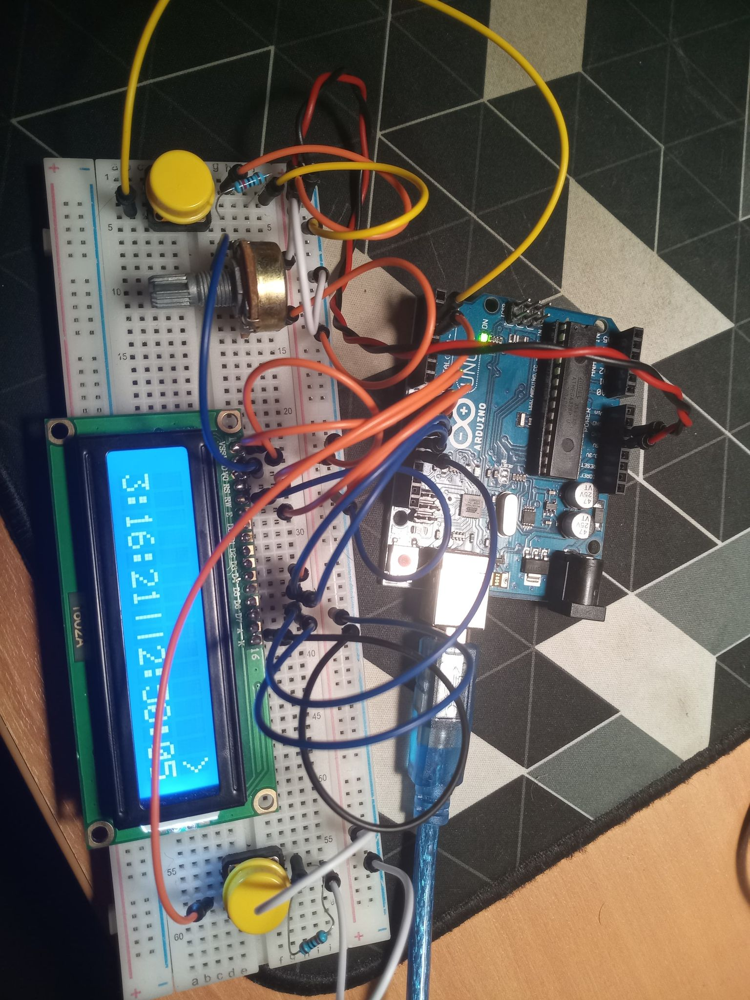

# Arduino chess clock

For now the time is software-defined.

## What you need

* 1 x Arduino UNO
* 1 x 16x2 LCD
* 2 x 2 buttons
* 2 x 10kΩ resistors
* 1 x 10kΩ potentiometer
* jumper wires
## Connections

## TODO

* Add time menu
* Comments
